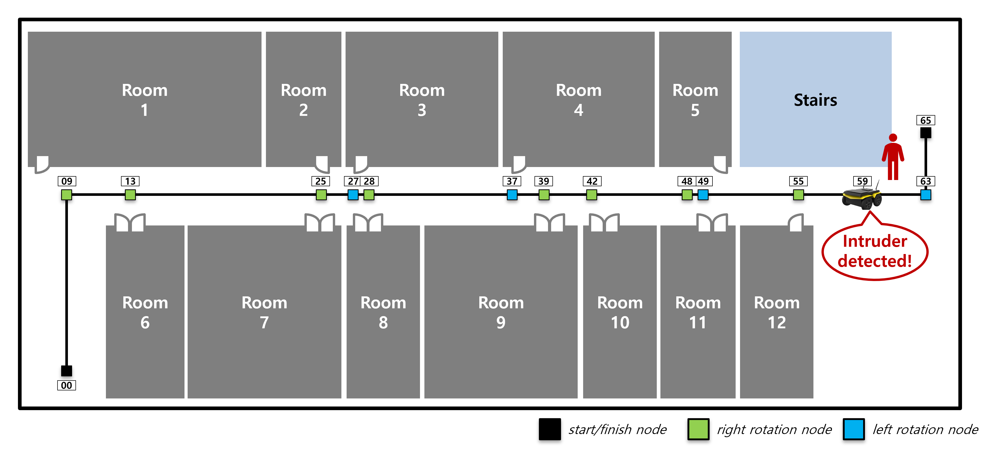
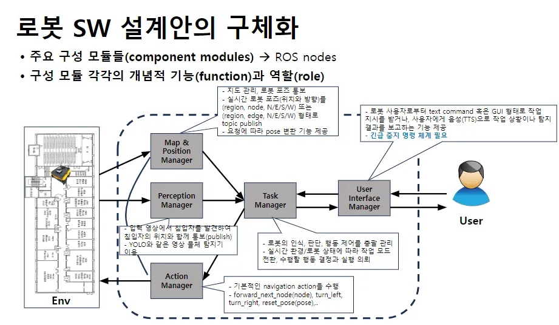

# Patrol_Service

<br>

## 🫡 프로젝트 소개

- **Jackal 로봇과 ROS1**을 활용한 **침입자 탐지 및 순회 감시(patrol)** 시스템




- **작업 시나리오**
    1. 사전 정의된 경로를 따라 로봇 이동
    2. 이동 과정에서 침입자 탐지
    3. 인물 발견 시 알람 및 해당 인물이 시야 내에서 사라질 때까지 이동 정지
    4. 모든 노드 방문 후 작업 종료

<br>

## ✨ 주요 기능

- 경기대학교 5층을 기반의 **Isaac Sim 가상 환경** 활용
- **로봇 지능 체계 시스템**(DM, MPM, AM, TM, …)으로 구조화
- 로봇은 **실시간 위치 추적(MPM), 환경 인식(DM), 주행(AM)** 등의 기능 수행
- 제로샷 물체 탐지기를 활용하여 특정 인물 탐지 (특정 색상의 모자를 쓴 사람 탐지)
- 침입자 탐지 시, **TTS 음성 알림** 제공

<br>

## **🏗️ 모듈 설계도**



<br>

## ⚙️ 시스템 설계 문서

[시퀀스 다이어그램(notion)](https://www.notion.so/11e6cf9cb796800b888cd17a197be68b?pvs=21)

[모듈별 입출력 메시지 형식.xlsx](attachment:101dac3f-0c91-45eb-9e6a-bba872f22102:모듈별_입출력_메시지_형식.xlsx)

<br>

## 🔹 역할

- **환경 구현**
    - **경기대학교 5층 복도**를 **Isaac Sim 환경**에서 구축
    - 로봇 이동을 위해 **환경 노드화 및** T**opological map 작성**
        - 노드의 **이름, 유형, 영역, 좌표 및 연결 정보** 저장
        - **예시:**
            
            ```
            Vertex
            name 0
            type 0
            region 0
            pos 0.0 0.0 0.0
            edge 9
            ```
            
- **DM (Detection Manager)**
    - **침입자 탐지 및 침입자 위치 계산 기능 개발**
    - **Grounding-DINO 모델**을 통한 침입자 탐지 기능 구현
    - 경계 상자 내 depth 값 기준으로 침입자의 **3D 위치 계산 로직** 구현
    
    📂 관련 코드 :  [Detection_Manager.py](https://www.notion.so/Detection_Manager-py-19c6cf9cb79680de91e5d44e870bdf77?pvs=21)
    
- **MPM (Map & Position Manager)**
    - **지도 관리 및 실시간 위치 변환 기능 개발**
    - 지도와 벡터 내적을 활용하여 **로봇의 물리적 위치(x, y, θ) → 논리적 위치(region, node, direction)**로 변환
    - **로봇 및 침입자의 위치 정보를 실시간 발행**하는 기능 구현
    
    📂 관련 코드 : [mapManager.py](https://www.notion.so/mapManager-py-19c6cf9cb79680f0806fe6f9a09ed36d?pvs=21) & [Map_Pose_Manager.py](https://www.notion.so/Map_Pose_Manager-py-19c6cf9cb79680819f04d7216cb9dabb?pvs=21)
    
<br>

## 🔍 개선 사항, 효과 등

- **다양한 로봇 플랫폼과 호환성 확보**: 모듈화된 시스템 설계를 통해, 향후 다른 로봇 플랫폼이나 새로운 작업 환경에서의 호환 가능함
- **프로젝트 확장성 및 탐지 정확성 확보**: 제로-샷 물체 탐지기를 활용하여 다양한 물체 탐지 환경에 쉽게 확장 가능하며, 새로운 탐지 객체 추가 시 별도의 학습 없이 바로 적용 가능함
- **효율적인 지도 관리 시스템:** 노드 기반 지도 설계로 효율적인 환경 인식과 최적화된 경로 탐색 등 향상된 주행 성능을 보여주며, 장애물 회피와 동적 경로 변경에 효과적으로 대응함

<br>

## ⚠️ 어려웠던 점 [수정 예정]

<br>

## 🛠 해결했던 방법 [수정 예정]

<br>

## 🎥 데모(결과 시각화)

https://drive.google.com/file/d/1H9T2nf9TXrzBOGOfMjdpqe6vG-kKKNFC/view?usp=drive_link
